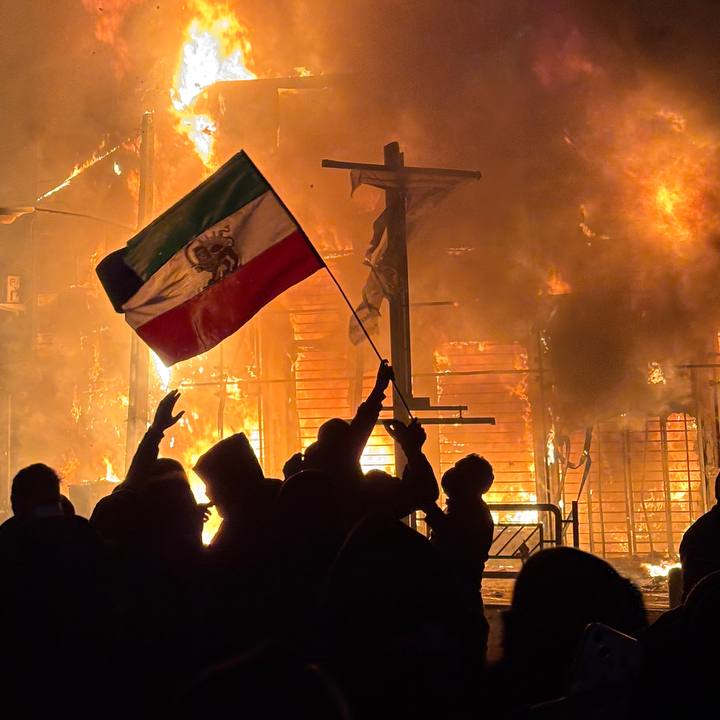

## What Happened in Iran

A few weeks ago, Iran went through one of the darkest periods in its modern history. During nationwide protests against economic hardship and political repression, **tens of thousands of people were killed in the crackdown** — with some estimates suggesting the death toll **could be over 30,000**. [^1][^2][^3]  
The Iranian regime responded with **extreme brutality**, using live ammunition, detentions, and violence against largely unarmed civilians.

To silence the population and prevent information from reaching the outside world, the authorities **shut down the internet nationwide for weeks**, disconnecting millions from global communication and reporting. [^4][^5][^6]

## What Iranian People Want
The Iranian people are not asking for anything extraordinary. They want a **normal life**, just like people in other countries.  
They want **freedom of expression**, freedom of choice, dignity, safety, and the chance to build their lives without fear of violence or repression.

## How You Can Help

One of the most important things Iranians need is to be **understood and heard**. Share accurate information on social media, keep conversations about these events alive, and support global awareness.  
Access to **free and uncensored internet** is critical — technologies like **Starlink** and other tools that bypass censorship help people stay connected, document what’s happening, and communicate with the world when networks are shut down.

Awareness matters. Visibility matters. Silence only helps oppression.

---

### References

[^1]: “Disappeared bodies, mass burials and ‘30,000 dead’: what is the truth of Iran’s death toll?” — *The Guardian*. Reports official figures and claims that actual deaths could be much higher. https://www.theguardian.com/global-development/2026/jan/27/iran-protests-death-toll-disappeared-bodies-mass-burials-30000-dead 
[^2]: *2026 Iran massacres* — Wikipedia article summarizing a range of estimates of fatalities during the protests, from official to independent claims. https://en.wikipedia.org/wiki/2026_Iran_massacres
[^3]: *Iran: Growing Evidence of Countrywide Massacres* — Human Rights Watch reporting on violent government response. https://www.hrw.org/news/2026/01/16/iran-growing-evidence-of-countrywide-massacres  
[^4]: *2026 Internet blackout in Iran* — Wikipedia overview of the extensive nationwide internet shutdown imposed during the protests. https://en.wikipedia.org/wiki/2026_Internet_blackout_in_Iran
[^5]: *Iran’s internet shutdown signals a new stage of digital isolation* — Analysis of the shutdown and its impact on connectivity and information flow. https://www.chathamhouse.org/2026/01/irans-internet-shutdown-signals-new-stage-digital-isolation
[^6]: *Update: #Iran's internet blackout continues through its 18th day, obscuring the extent of a deadly crackdown on civilians.* — *The NetBlocks*. https://mastodon.social/@netblocks/115960623813759479
